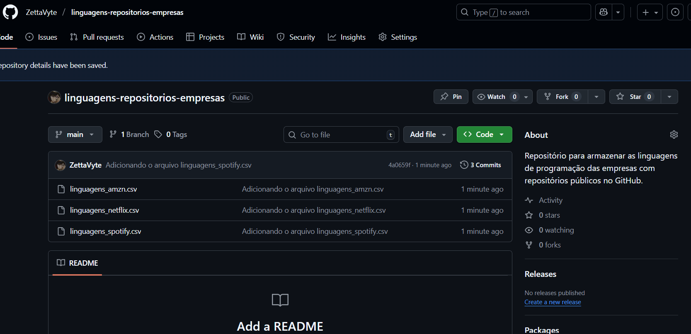

# Pipeline ETL com Integração à API do GitHub



[linguagens-repositorios-empresas](https://github.com/ZettaVyte/linguagens-repositorios-empresas)

Este projeto consiste em um pipeline de **Engenharia de Dados** desenvolvido em Python, que realiza a extração, transformação e carga (ETL) de dados de repositórios públicos de grandes empresas de tecnologia (Amazon, Netflix, Spotify e Apple).

O objetivo é mapear as linguagens de programação mais utilizadas por essas empresas e armazenar os resultados processados em um novo repositório no GitHub automaticamente.


## 🗂 Estrutura do Projeto

O projeto foi estruturado utilizando conceitos de **Programação Orientada a Objetos (POO)** para garantir modularidade e reutilização de código.

├── dados/ # Diretório onde os arquivos CSV processados são salvos localmente 

├── evidencias/ # Screenshots comprovando a execução e criação dos repositórios 

├── armazenando_dados.py # Script responsável pelo LOAD (Carga) dos dados na API 

├── dados_repos.py # Classe responsável pela EXTRACTION (Extração) e TRANSFORMATION (Transformação) 

├── extraindo_dados.py # Script principal de execução da extração 

├── manipula_repos.py # Classe utilitária para manipulação de repositórios (criação e upload) 

├── requests.ipynb # Jupyter Notebook com a exploração passo a passo e testes 

└── requirements.txt # Lista de dependências do projeto 

## ⚙️ Funcionalidades e Pipeline ETL

O projeto executa as seguintes etapas:

1.  **Extração (Extract):**
    * Conexão com a API do GitHub utilizando a biblioteca `requests`.
    * Autenticação via Token para aumento da taxa limite de requisições.
    * Paginação automática para varrer todos os repositórios públicos das organizações alvo.
2.  **Transformação (Transform):**
    * Processamento dos dados brutos (JSON).
    * Agrupamento e contagem das linguagens de programação utilizando `Pandas`.
    * Geração de DataFrames estruturados.
3.  **Carga (Load):**
    * Salvamento local dos dados em formato `.csv` na pasta `dados/`.
    * Criação automática de um novo repositório no GitHub via requisição `POST`.
    * Upload dos arquivos CSV gerados para este novo repositório via requisição `PUT`, utilizando codificação em Base64.

## 🛠 Tecnologias Utilizadas

* **Python 3**
* **Requests:** Para todas as interações HTTP (GET, POST, PUT, DELETE).
* **Pandas:** Para manipulação e análise de dados tabulares.
* **Python-Dotenv:** Para gerenciamento seguro de credenciais.
* **Base64:** Para codificação de arquivos binários/texto para upload via API.

## 🚀 Como Executar o Projeto

### Pré-requisitos

* Python 3.10 ou superior.
* Conta no GitHub e um **Personal Access Token** (Classic) com permissões de `repo` e `user`.

### Passo a Passo

1.  **Clone o repositório:**
    ```bash
    git clone https://github.com/ZettaVyte/projeto_Requests
    cd seu-repo
    ```

2.  **Crie e ative um ambiente virtual:**
    ```bash
    # No Windows/WSL/Linux:
    python3 -m venv .venv
    source .venv/bin/activate
    ```

3.  **Instale as dependências:**
    ```bash
    pip install -r requirements.txt
    ```

4.  **Configuração de Segurança (.env):**
    Crie um arquivo chamado `.env` na raiz do projeto e adicione suas credenciais (renomeie o `.env.example` se houver):
    ```env
    GITHUB_TOKEN=seu_token_aqui_sem_aspas
    USER_GITHUB=seu_nome_de_usuario
    ```

5.  **Executando o ETL:**

    * **Passo 1: Extrair e Transformar**
        ```bash
        python extraindo_dados.py
        ```
        *Isso irá gerar os arquivos CSV na pasta `dados/`.*

    * **Passo 2: Carregar no GitHub**
        ```bash
        python armazenando_dados.py
        ```
        *Isso criará o repositório 'linguagens-repositorios-empresas' no seu GitHub e fará o upload dos arquivos.*

## 📊 Resultados

Você pode conferir o funcionamento do código através do notebook `requests.ipynb` ou visualizando os prints na pasta `evidencias/`.

O resultado final é a criação automática de um repositório contendo análises como:
* `linguagens_amzn.csv`
* `linguagens_netflix.csv`
* `linguagens_spotify.csv`
* `linguagens_apple.csv`

---
**Desenvolvido durante o curso Python e APIs: conhecendo a biblioteca Requests da Alura.**